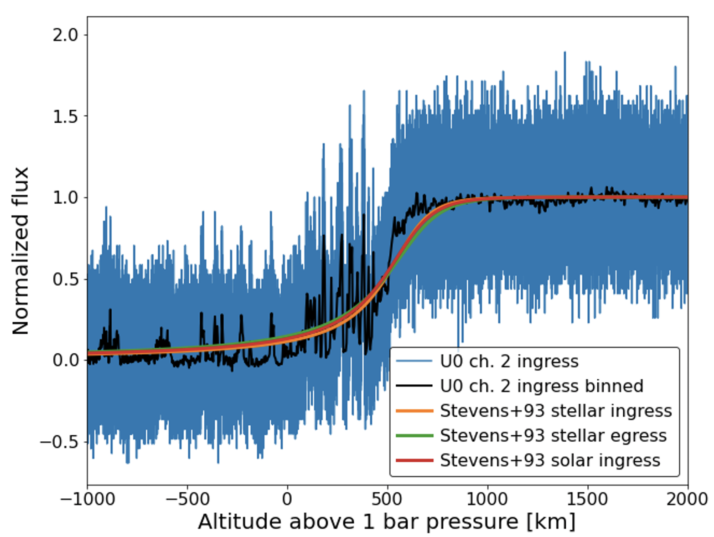

```{r setup, include=FALSE}
options(warn=-1)
knitr::opts_chunk$set(echo = TRUE)
```

## Background

A Stellar occultation is when a solar system body briefly blocks a distant planet, which results in a gradual decrease of the star’s light. Observations of an occultation produce a light curve, which can be used to determine the occulting planet’s atmosphere properties [from light curve to atmosphere properties]. Reversely, we can also forward model an atmosphere profile to predict the occultation light curve that would result from an occultation by that atmosphere [from atmosphere properties to light curve].

The goal of this project is to compare the forward model to a suite of archival observed light curve and trying to determine if they are consistent or inconsistent. For example, in Figure 1, three forward models are shown compared to observed datasets in blue and black line is a binned version of the blue data.


{#id .class width=50% height=50%}

Therefore, our null hupothesis is: the observed data is drawn from the same underlying distribution as the forward model results.


## About Kolmogorov-simirnov Test

K-S test is a nonparametric statistical test method for continuous distribution:
1.Single sample test
Example code: ks.test(data, distribution, parameter)
Such as : ks.test(x.”pgamma”,3,2)

2.Double sample test
Example code: ks.test(data1, data2)

Equation: 


