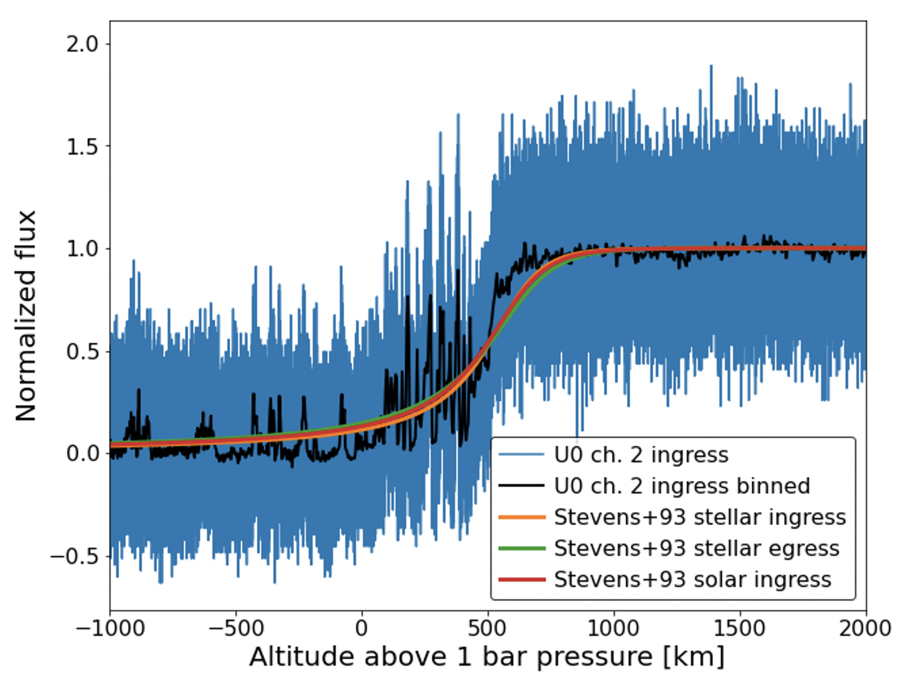

```{r setup, include=FALSE}
options(warn=-1)
knitr::opts_chunk$set(echo = TRUE)
```

## Background

A Stellar occultation is when a solar system body briefly blocks a distant planet, which results in a gradual decrease of the star’s light. Observations of an occultation produce a light curve, which can be used to determine the occulting planet’s atmosphere properties [from light curve to atmosphere properties]. Reversely, we can also forward model an atmosphere profile to predict the occultation light curve that would result from an occultation by that atmosphere [from atmosphere properties to light curve].

The goal of this project is to compare the forward model to a suite of archival observed light curve and trying to determine if they are consistent or inconsistent. For example, in Figure 1, three forward models are shown compared to observed datasets in blue and black line is a binned version of the blue data.


{#id .class width=50% height=50%}

Therefore, our null hupothesis is: the observed data is drawn from the same underlying distribution as the forward model results.


## About Kolmogorov-smirnov Test 

K-S test is a nonparametric statistical test method for continuous distribution:

1.Single sample test

Example code: ks.test(data, distribution, parameter)

Such as : ks.test(x.”pgamma”,3,2)

2.Double sample test:
Example code: ks.test(data1, data2)

Equation:
{#id .class width=20% height=10%}

B(t): Brownian Bridge

Also:

{#id .class width=20% height=10%}


## Limitations of K-S Test

1. Continuous distribution

2. Nonparametric test method


## Kullback-Leibler Divergence & Jensen-Shannon Divergence

K-L Divergence: Measure the distance in probability distribution space, but the dicrimination of similarity is not accurate due to the asymmetry of its structure .


J-S Divergence: Variant of K-L divergence which solves the problem of asymmetry of KL divergence. 

## J-S Divergence

Equation:

{#id .class width=20% height=10%}

Where:

{#id .class width=20% height=10%}

Discrete: also could be written as: 

{#id .class width=20% height=10%}

Characteristics: 1. Symmetric.

                 2. Range: [0,1]


## Codes of J-S Divergence

Discrete variables:

import numpy as np

import scipy.stats
def JS_divergence(p,q)

M=(p+q)/2

return 0.5*scipy.stats.entropy(p,M)+0.5*scipy.stats.entropy(q, M)

print(JS_divergence(data1, data2))


Continuous variables:

from scipy.stats import norm

import pandas as pd

def JS_div(arr1,arr2,num_bins):

max0 = max(np.max(arr1),np.max(arr2))

min0 = min(np.min(arr1),np.min(arr2))

bins = np.linspace(min0-1e-4, max0-1e-4, num=num_bins)

PDF1 = pd.cut(arr1,bins).value_counts() / len(arr1)

PDF2 = pd.cut(arr2,bins).value_counts() / len(arr2)

return JS_divergence(PDF1.values,PDF2.values)

print(JS_div(data1,data2,num_bins=20))


## Summary
We model an atmospheric profile to predict the occultation by the atmosphere published.We use K-S test and J-S Divergence to analysis the model.Our client has the problem on working on the K-S test, we will help them to figure it out. Due to the fact that K-S test has some limitations, we use J-S Divergence as the most part to analysis the data. Because  in this project, we don’t have real data set to analysis, we generate some data as an example, and provide codes to construct the confidence band. 


